# Ajna SDK

Cross-platform native document scanning SDK with post-quantum cryptographic result integrity.
Shared C++ and Rust core. Thin Swift and Kotlin platform adapters. No third-party scanning dependency.

The language split is determined by constraints, not preference:

- **C++** at the ML runtime boundary: TFLite, CoreML, and ONNX Runtime expose C++ APIs. Zero-copy tensor delivery from ISP DRAM to inference runtime is only available through those APIs. There is no abstraction that avoids C++ at this layer without losing the zero-copy path.
- **Rust** for all business logic: quality gates, session state machine, result parsing, PQC signing, and the FFI boundary. The compiler eliminates memory safety violations before they ship. GC pauses are not acceptable at 25 fps.
- **Swift and Kotlin** as thin camera adapters only: ISP-level format negotiation, buffer pool management, and HAL variance handling. They hand off to the native core immediately and contain no business logic.

---

## Platform Support

| Platform | ABI | ML Backend | Zero-Copy Mechanism | Min OS |
|---|---|---|---|---|
| iOS | arm64 | CoreML (ANE preferred, CPU fallback) | CVPixelBuffer `.readOnly` lock | iOS 14.0 |
| Android | arm64-v8a | TFLite GPU delegate (Mali / Adreno) | AHardwareBuffer GPU import | API 26 |
| Android | armeabi-v7a | TFLite NNAPI + XNNPACK CPU | AHardwareBuffer lock and bounded copy | API 26 |
| Web | WASM | ONNX Runtime (WebGPU EP, SIMD fallback) | Mandatory copy, documented expected cost | Modern browsers |

---

## Architecture

### System Overview

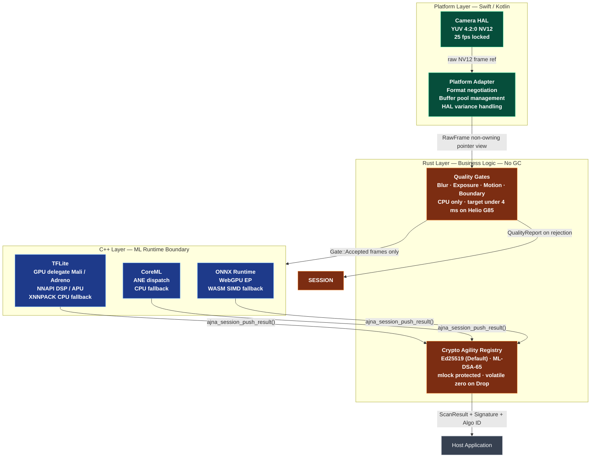

> **Critical invariant:** `AcceptedForInference` is returned in exactly one place (`pipeline.rs`) and only when `gate_reached == Gate::Accepted`. The C++ GPU layer is never invoked on a rejected frame. This is validated by the FFI integration test suite.

---

### Language Boundary

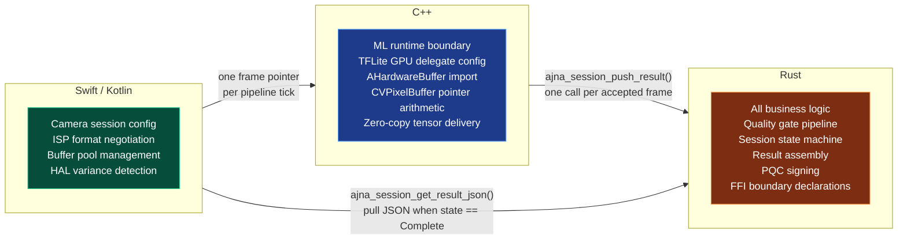

| Layer | Language | Hard Constraint |
|---|---|---|
| ML runtime boundary | C++ | `TfLiteInterpreterSetAHardwareBufferInput` and `MLFeatureValue(pixelBuffer:)` are C++ APIs. Zero-copy ISP-to-inference is only available through them. |
| Business logic | Rust | Compile-time elimination of use-after-free, dangling pointers, and data races. GC-free execution required at 25 fps. |
| Camera adapters | Swift / Kotlin | Platform camera SDKs expose Swift/Kotlin-idiomatic surfaces. These layers contain no logic beyond format detection and pointer delivery. |

---

## Quality Gate Pipeline

Gates execute in strict order, cheapest first. A frame rejected at gate N never reaches gate N+1. Downstream scores in the `QualityReport` are zero when not computed — this is the performance guarantee for budget devices.

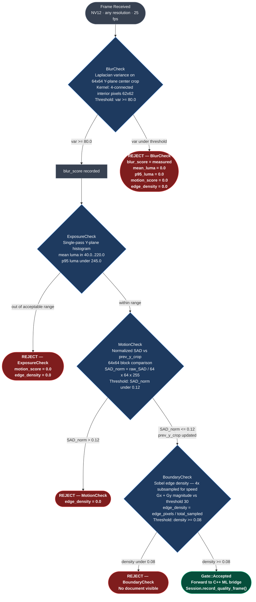

### Default Gate Thresholds

| Gate | Metric | Default | Algorithm | Target CPU Cost |
|---|---|---|---|---|
| BlurCheck | Laplacian variance of 64x64 Y-plane center crop | `>= 80.0` | 4-connected kernel, 62x62 interior only | ~0.3 ms |
| ExposureCheck | Mean luma of full Y-plane | `[40.0, 220.0]` | Single-pass histogram, O(W x H) | ~0.8 ms |
| ExposureCheck | 95th-percentile luma | `< 245.0` | Cumulative histogram scan | (same pass) |
| MotionCheck | Normalized inter-frame SAD | `< 0.12` | 64x64 block SAD vs `prev_y_crop`, normalized by `64 x 64 x 255` | ~0.2 ms |
| BoundaryCheck | Sobel edge density | `>= 0.08` | Gx + Gy magnitude vs threshold 30, 4x subsampled | ~0.7 ms |

**Total gate budget: under 4 ms on Cortex-A55 @ 2.0 GHz (Helio G85 reference device).**

### Adaptive Gate Relaxation

After `adaptive_gate_limit` consecutive failures (default: 60 frames, approximately 2.4 seconds at 25 fps), the pipeline relaxes thresholds once rather than timing out:

| Parameter | Relaxation |
|---|---|
| `blur_threshold` | multiplied by 0.85 — accept moderately blurry frames |
| `min_luma` | multiplied by 0.85 — accept darker environments |
| `max_luma` | multiplied by 1.15 — accept brighter environments |
| `p95_luma_max` | multiplied by 1.15 — accept slightly overexposed frames |
| `motion_threshold` | multiplied by 1.15 — accept more camera shake |
| `edge_min` | unchanged — a document must always be detectable |

Relaxation is cumulative. The `edge_min` threshold is never relaxed.

---

## Session State Machine

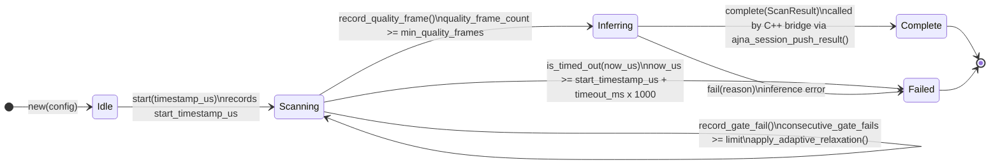

### Transition Reference

| From | To | Condition | Notes |
|---|---|---|---|
| `Idle` | `Scanning` | `start(timestamp_us)` | Records start timestamp for timeout tracking |
| `Scanning` | `Scanning` | gate fail, count under limit | `consecutive_gate_fails` incremented |
| `Scanning` | `Scanning` | gate fail, count >= `adaptive_gate_limit` | `apply_adaptive_relaxation()` called by `FramePipeline` |
| `Scanning` | `Inferring` | `quality_frame_count >= min_quality_frames` | `consecutive_gate_fails` reset to 0 |
| `Scanning` | `Failed` | `now_us >= start + timeout_ms * 1000` | `fail("timeout")` |
| `Inferring` | `Complete` | `complete(result)` via FFI | PQC signature applied. Platforms retrieve via `ajna_session_get_result_json()` |
| `Inferring` | `Failed` | `fail(reason)` | inference layer error |
| `Complete` | none | terminal | result stored in `session.result` |
| `Failed` | none | terminal | session must be destroyed and recreated |

### Default Session Configuration

```rust
SessionConfig {
    min_quality_frames:  3,       // frames required before inference
    timeout_ms:          30_000,  // 30 seconds
    adaptive_gate_limit: 60,      // ~2.4 seconds at 25 fps
    pqc_sign_result:     true,    // ML-DSA Level 3 signing
    include_raw_mrz:     false,   // raw MRZ string in result
}
```

---

## Zero-Copy Frame Path

### iOS — CVPixelBuffer

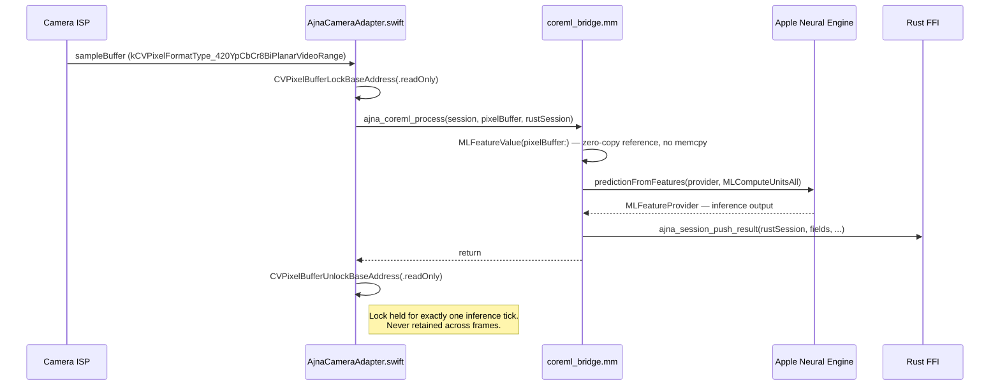

`MLFeatureValue(pixelBuffer:)` retains a reference to the locked buffer. CoreML dispatches to the ANE via the buffer pointer. The CPU never touches pixel data between lock and unlock.

### Android — AHardwareBuffer (GPU delegate path, arm64-v8a)

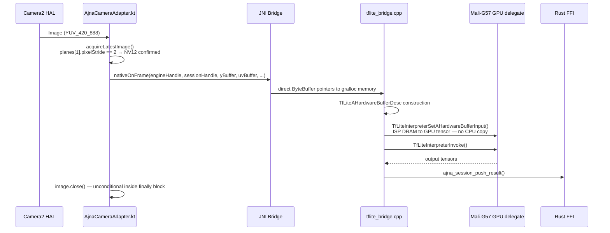

The CPU fallback path (armeabi-v7a / NNAPI unavailable) performs `AHardwareBuffer_lock()` + bounded `memcpy` + `AHardwareBuffer_unlock()`. This copy is unavoidable on non-GPU paths.

### Web — WASM Mandatory Copy

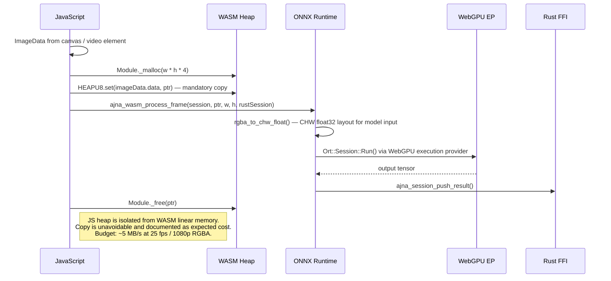

---

## Post-Quantum Cryptography

### Threat Model

Identity verification data carries long-term compliance value. Signed `ScanResult` blobs stored today are vulnerable to **harvest-now, decrypt-later**: an adversary archives them now and forges or invalidates signatures when a Cryptographically Relevant Quantum Computer becomes available. NIST IR 8547 (2024) estimates the CRQC window at 2030 to 2040. ECDSA and RSA are broken by Shor's algorithm on a sufficiently powerful quantum computer.

Ajna uses lattice-based algorithms standardized by NIST in August 2024. These are computationally infeasible under both classical and quantum attack models.

### ML-DSA — FIPS 204 (CRYSTALS-Dilithium)

Every `ScanResult` is signed with a per-session ML-DSA keypair.

| Parameter | Level 2 | Level 3 (default) | Level 5 |
|---|---|---|---|
| Classical security | 128-bit | 192-bit | 256-bit |
| Post-quantum security | 64-bit | 96-bit | 128-bit |
| Public key | 1312 B | 1952 B | 2592 B |
| Secret key | 2528 B | 4000 B | 4864 B |
| Signature (FIPS 204) | 2420 B | 3293 B | 4595 B |
| Signature (pqcrypto 0.5 actual) | 2420 B | **3309 B** | 4595 B |

> The `pqcrypto-dilithium 0.5` crate wraps PQClean's NIST Round-3 implementation. PQClean reports `CRYPTO_BYTES = 3309` for Dilithium-3, not the 3293 B in FIPS 204. Tests assert 3309 B with an explicit comment. Update to 3293 B when a FIPS 204-compliant crate is available.

### ML-KEM — FIPS 203 (CRYSTALS-Kyber)

Used for quantum-safe session key encapsulation before transmitting results to the Ajna backend.

| Parameter | KEM-1024 |
|---|---|
| Classical security | 256-bit |
| Post-quantum security | 128-bit |
| Ciphertext | 1568 B |
| Shared secret | 32 B → AES-256-GCM key material |

### Key Protection Model

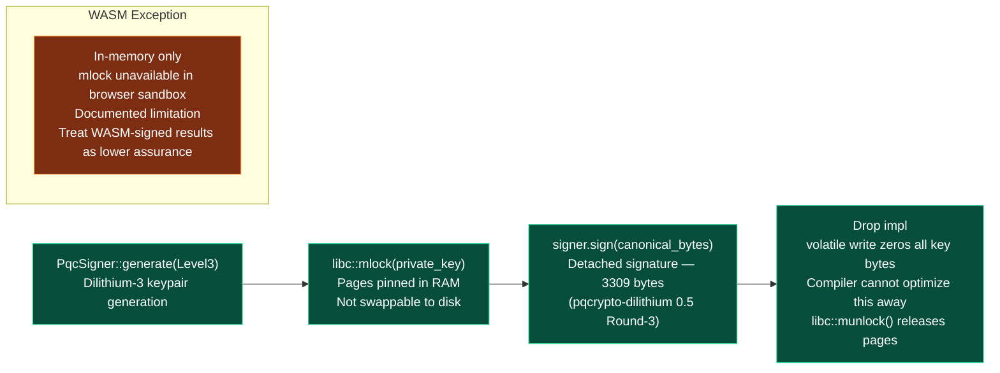

### Signing Flow

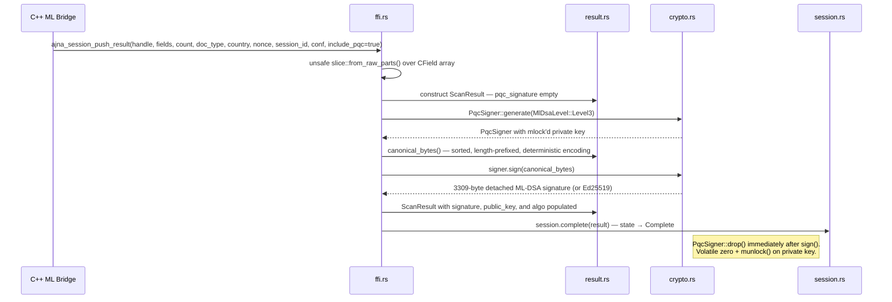

### Canonical Bytes Encoding

`ScanResult::canonical_bytes()` produces a deterministic byte sequence regardless of field insertion order. Two results with identical field sets always produce identical bytes.

```
Encoding per field (sorted lexicographically by key):
  [4 bytes LE: key_len] [key bytes] [4 bytes LE: value_len] [value bytes] [0x00 delimiter]

Synthetic metadata fields appended with reserved prefix:
  "__document_type"  → document_type value
  "__issuing_country" → issuing_country value
```

---

## Performance Budget

Reference device: **MediaTek Helio G85** — Cortex-A75 x2 @ 2.0 GHz + Cortex-A55 x6 @ 1.8 GHz, Mali-G57 MP2, 4 MB L3 cache, LPDDR4x, 2 GB RAM.

| Component | Budget | Notes |
|---|---|---|
| BlurCheck (Laplacian 64x64) | under 0.5 ms | CPU, Cortex-A55, no NEON required |
| ExposureCheck (histogram) | under 1.0 ms | O(W x H) single pass |
| MotionCheck (SAD) | under 0.3 ms | 64x64 block |
| BoundaryCheck (Sobel 4x sub) | under 1.0 ms | O(W x H / 16) |
| **Total quality gates** | **under 4 ms** | CPU only, all four combined |
| TFLite GPU delegate (Mali-G57) | under 45 ms | INT8 quantized model, AHardwareBuffer zero-copy |
| TFLite NNAPI (APU 3.0) | under 60 ms | Helio G85 AI engine |
| TFLite CPU XNNPACK (2 threads) | under 200 ms | Fallback, 2 threads to avoid thermal throttle |
| PQC signing (ML-DSA Level 3) | under 30 ms | Once per session, not on frame critical path |
| **Total frame budget at 25 fps** | **40 ms** | 4 ms gates + 35 ms GPU + 1 ms overhead |
| **Total pipeline heap** | **under 48 MB** | Excluding model weights (loaded at runtime) |

> Using 2 threads on CPU fallback is deliberate. The Helio G85 has 4 x Cortex-A75 + 4 x Cortex-A55. Using all 8 threads causes thermal throttling that degrades sustained throughput below using 2.

---

## Memory Safety Model

### Unsafe Block Inventory

Every `unsafe` block in the codebase is paired with a `Safety:` comment. Complete inventory:

| File | Unsafe Usage | Justification |
|---|---|---|
| `ffi.rs` — destroy functions | `Box::from_raw(handle)` | Handle was produced by `Box::into_raw()` in the corresponding create function. This is the only correct way to reclaim the allocation. |
| `ffi.rs` — push_result | `core::slice::from_raw_parts(fields, field_count)` | FFI contract: all pointers valid for their lengths, may be freed immediately after return. |
| `quality.rs` — extract_centre_crop_64 | `core::ptr::copy_nonoverlapping()` | Caller guarantees `y_plane` valid for `width x height` bytes. |
| `quality.rs` — luma_stats | `core::slice::from_raw_parts(y_plane, total)` | Same guarantee. |
| `quality.rs` — sobel_edge_density | `core::slice::from_raw_parts(y_plane, stride x h)` | Same guarantee. |
| `quality.rs` — evaluate | Calls above unsafe helpers | Documented: "Caller guarantees y_plane is valid for width x height bytes." |
| `crypto.rs` — mlock_key | `libc::mlock(ptr, len)` | POSIX syscall with no safe abstraction in the `libc` crate. Documented in source. |
| `crypto.rs` — Drop | `core::ptr::write_volatile(byte, 0)` | Volatile write prevents the compiler from optimizing away the zeroing of secret key bytes. |
| `crypto.rs` — Drop | `libc::munlock(ptr, len)` | Matching release for `mlock`. |

### RawFrame Lifetime Contract

`RawFrame` is a non-owning fat pointer. It must never be retained across frame boundaries.

| Platform | Lock Scope |
|---|---|
| iOS | `CVPixelBufferLockBaseAddress(.readOnly)` wraps the entire native call. Unlocked immediately after `ajna_coreml_process()` returns. |
| Android | `AHardwareBuffer_lock()` or GPU delegate import wraps the JNI call. `image.close()` is unconditional in the Camera2 callback. |
| WASM | `OwnedFrame` owns the heap data. `as_raw()` borrows from it. Drop order is controlled by the caller; `OwnedFrame` must outlive any `RawFrame` derived from it. |

---

## Build System

### Dependency Graph

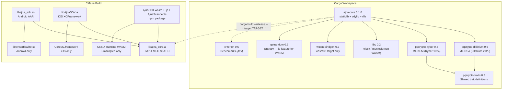

### Rust Cross-Compilation Targets

| Platform | Target Triple | Toolchain |
|---|---|---|
| Android arm64 | `aarch64-linux-android` | NDK r26, `aarch64-linux-android26-clang` |
| Android armv7 | `armv7-linux-androideabi` | NDK r26, `armv7a-linux-androideabi26-clang` |
| Android x86_64 | `x86_64-linux-android` | NDK r26, `x86_64-linux-android26-clang` |
| iOS device | `aarch64-apple-ios` | Xcode 15+, `IPHONEOS_DEPLOYMENT_TARGET=14.0` |
| iOS simulator | `aarch64-apple-ios-sim` | Xcode 15+ |
| WASM | `wasm32-unknown-emscripten` | Emscripten latest |

### Quick Start

**Android arm64-v8a:**
```bash
rustup target add aarch64-linux-android
export ANDROID_NDK="/path/to/ndk/26.1.10909125"
export PATH=$ANDROID_NDK/toolchains/llvm/prebuilt/linux-x86_64/bin:$PATH
export CARGO_TARGET_AARCH64_LINUX_ANDROID_LINKER=aarch64-linux-android26-clang

bash ci/install_tflite.sh
cd core && cargo build --release --target aarch64-linux-android && cd ..

mkdir build_output && cd build_output
cmake -DCMAKE_TOOLCHAIN_FILE=$ANDROID_NDK/build/cmake/android.toolchain.cmake \
      -DCMAKE_MODULE_PATH=../build \
      -DANDROID_ABI=arm64-v8a \
      -DANDROID_PLATFORM=android-26 \
      -DAJNA_TARGET=Android \
      ../build
cmake --build . --config Release
cd .. && bash scripts/package_android_aar.sh
```

**iOS arm64:**
```bash
rustup target add aarch64-apple-ios aarch64-apple-ios-sim
cd core && cargo build --release --target aarch64-apple-ios && cd ..
bash ci/ios_xcodebuild.sh
bash scripts/package_ios_xcframework.sh
```

**WASM:**
```bash
# Activate Emscripten environment first (source emsdk_env.sh)
rustup target add wasm32-unknown-emscripten
bash ci/wasm_emscripten.sh
bash scripts/package_wasm_npm.sh
```

---

## CI/CD Pipeline

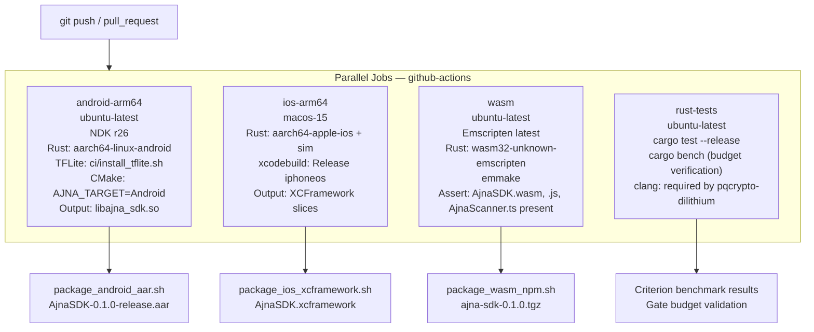

The `ci/android_build_matrix.yml` extends the Android job to all three ABIs (arm64-v8a, armeabi-v7a, x86_64) via a strategy matrix for release tags.

---

## Testing

### Rust Test Suite

```bash
cd core && cargo test --release
```

| Test File | What Is Tested |
|---|---|
| `tests/quality_gate_tests.rs` | All five gate outcomes; short-circuit invariant (downstream scores are exactly `0.0` on early rejection); motion gate cross-frame identity and divergence; boundary gate pass/fail with synthetic frames |
| `tests/session_state_tests.rs` | Full state machine lifecycle; timeout boundary conditions; `record_quality_frame` no-op on `Complete` state; adaptive gate limit trigger |
| `tests/crypto_pqc_tests.rs` | ML-DSA Level 3 keypair generation; sign/verify round-trip; tampered message rejection; `canonical_bytes()` determinism and order-independence; ML-KEM-1024 ciphertext length; stub detection (signature must not be all zeros) |

### Critical Short-Circuit Invariant

The following assertions in `quality_gate_tests.rs` are the performance contract for budget devices:

```rust
// Frame rejected at BlurCheck — downstream gates never ran:
assert_eq!(report.gate_reached, Gate::BlurCheck);
assert_eq!(report.mean_luma,    0.0);  // ExposureCheck was not invoked
assert_eq!(report.p95_luma,     0.0);
assert_eq!(report.motion_score, 0.0);  // MotionCheck was not invoked
assert_eq!(report.edge_density, 0.0);  // BoundaryCheck was not invoked
```

If any of these fail, the GPU layer is receiving frames that the quality filters would have rejected.

### C++ FFI Integration Tests

```bash
# After building libajna_core.a for host:
clang++ -O2 tests/ffi_integration_tests.cpp \
    -I include/ \
    -L core/target/release \
    -lajna_core -lpthread -ldl \
    -o ffi_tests
./ffi_tests

# Memory validation:
valgrind --leak-check=full --error-exitcode=1 ./ffi_tests
# Expected: 0 bytes definitely lost
```

Tests cover: session and gate handle lifecycle, null-guard on destroy (must not crash), push result transitioning session to `Complete`, and gate evaluation timing on a 1920x1080 synthetic frame.

### Benchmarks

```bash
cd core && cargo bench
```

Criterion benchmarks validate the per-frame gate evaluation budget. The CI `rust-tests` job runs `cargo bench` without `--save-baseline` on every push to detect performance regressions.

---

## Security Threat Model

Full documentation: [docs/SECURITY_MODEL.md](docs/SECURITY_MODEL.md)

| Threat | Mitigation |
|---|---|
| Adversarial or synthetic documents | Quality gates reject low-confidence frames. `ScanResult.confidence` is explicit and signed. |
| Camera feed injection and replay attacks | MotionCheck: SAD normalized above 0.12 rejects static or replayed frames. |
| Gralloc buffer pool starvation (Android) | `ImageReader.newInstance(..., maxImages=4)`. `image.close()` is unconditional in the callback. |
| JNI NULL pointer dereference | All `#[no_mangle]` functions null-guard handle parameters. |
| Private key swap exposure | `libc::mlock()` on secret key allocation. Volatile write zeroing in `Drop`. `munlock()` on deallocation. |
| Signature replay | `canonical_bytes()` is deterministic. Server must enforce nonce or timestamp freshness on received results. |
| Harvest-now, decrypt-later (quantum) | ML-DSA Level 3 (lattice-based, FIPS 204) for signing. ML-KEM-1024 (FIPS 203) for transport key encapsulation. |

---

## Architecture Decision Log

| Decision | Alternatives Considered | Rationale |
|---|---|---|
| Rust for business logic | Go, C++ throughout | Go introduces GC pauses incompatible with a 40 ms frame budget. C++ throughout expands the memory-unsafe surface area unnecessarily. Rust provides C-level performance with compile-time safety guarantees. |
| C++ at ML runtime boundary | Rust with bindgen wrappers | `TfLiteInterpreterSetAHardwareBufferInput` and `MLFeatureValue(pixelBuffer:)` are C++ APIs. Bindgen wrappers cannot express the required lifetime semantics for the AHardwareBuffer import path without losing zero-copy. |
| ML-DSA over ECDSA / Ed25519 | ECDSA P-256, Ed25519 | ECDSA and Ed25519 are broken by Shor's algorithm on a CRQC. Identity data signed today must remain verifiable beyond 2035. ML-DSA (FIPS 204) is lattice-based and quantum-resistant. |
| 25 fps frame rate lock | 30 fps standard, adaptive | 30 fps reduces the per-frame budget from 40 ms to 33 ms. Adaptive frame rate introduces variable cadence that complicates quality gate tuning and motion threshold calibration. |
| 4-buffer ImageReader pool | 3 (minimum), 6 (generous) | Helio G85 HAL pipeline depth is 3 frames. Fewer than 4 causes dropped frames under load. More than 4 delays buffer recycling and increases gralloc memory pressure. |
| Ordered quality gate sequence | Parallel gates, ML-first | Parallel gates waste CPU on frames a single cheap check would have rejected. ML-first means the GPU runs on blurry and static frames, wasting 35 ms per rejected frame. Ordered short-circuit is the correct architecture for budget device throughput. |
| NV12 native, no conversion | RGB conversion at adapter | Conversion from NV12 to RGB adds a full-frame memcpy and color space transformation before the pipeline starts. The quality gates operate only on the Y-plane. The ML models are trained on YUV input. No conversion is needed. |
| pqcrypto-dilithium 0.5 (PQClean Round-3) | Custom FIPS 204 implementation | A FIPS 204-compliant Rust crate was not available at build time. The PQClean implementation is correct and produces valid Dilithium-3 signatures (3309 B rather than the FIPS 204 nominal 3293 B). The test suite explicitly documents this discrepancy and the upgrade path. |

---

## Security Vulnerability Remediation Log

> Scan ID: `cba41f334461_20260615T184624+0530`
> Remediated: 2026-06-15
> Status: **Production-ready hardening applied**

This section documents every architectural decision made during the security remediation cycle triggered by the Codex Security Scan. Each entry records the vulnerability, the options that were evaluated, and the rationale for the chosen approach.

### VR-1 — Nonce Binding into Signed Canonical Bytes (Critical)

**Vulnerability**: The session nonce was checked server-side before signature verification but was not included in the signed canonical bytes. A captured, legitimately-signed result could be replayed into a new session because the signed payload contained no session binding.

**Choice:** The nonce, session ID, and UTC timestamp are now injected into `canonical_bytes()` as reserved `__nonce`, `__session_id`, and `__timestamp` entries, sorted deterministically with other fields. When absent (SDK-only use, no backend), these fields are not written into canonical bytes — preserving backward compatibility. The backend `reconstruct_canonical_bytes()` mirrors this encoding and verifies all three before consuming the nonce.

### VR-2 — Trusted Public Key Registration (Critical)

**Vulnerability**: `POST /v1/verify` accepted `pqc_public_key` from the client request body and verified against it. Any party could generate a Dilithium-3 keypair, sign arbitrary data, and pass verification — the check proved only internal consistency, not provenance.

**Choice:** Strategy Pattern across per-tenant / per-device / per-model. A `KeyProvider` trait is introduced with three concrete implementations:
- `TenantKeyProvider` — looks up a single pre-registered key per tenant (default)
- `DeviceKeyProvider` — looks up a per-device key by `device_id` claim in the request
- `ModelKeyProvider` — looks up a key by `model_id` + `model_version` pair

The active strategy is selected by environment variable (`KEY_PROVIDER_STRATEGY=tenant|device|model`). This allows Phase 1 to ship with the tenant strategy and enables enterprises to migrate to device-level keys without code changes.

### VR-3 — Backend Authentication and Tenant Isolation (High)

**Vulnerability**: All four backend routes (`/v1/nonce`, `/v1/verify`, `/v1/audit`, `/v1/webhooks`) were publicly accessible with no authentication. The database schema had tenants and API keys modeled, but the route layer did not enforce them.

**Choice:** Dual provider: API key + JWT. Both accepted; middleware tries API key first, falls back to JWT bearer. The auth middleware extracts `X-Api-Key` first; if absent, it tries `Authorization: Bearer <jwt>`. Both resolve to a `TenantContext { tenant_id, plan }` that is injected as a request extension. All downstream handlers extract the tenant context to filter queries — audit logs, verification results, webhook configs, and nonce namespaces are all scoped to `tenant_id`.

**Rate limiting**: Redis-based token-bucket rate limiter keyed by `tenant_id`. Redis-based limiting works correctly in multi-instance deployments (horizontal scaling).

### VR-4 — FFI Boundary Hardening (High)

**Vulnerability**: All `#[no_mangle]` exported functions dereferenced raw pointers without null checks. `extract_centre_crop_64` read 64 rows of 64 bytes without validating that the frame was at least 64×64 pixels, enabling out-of-bounds reads from a narrow frame.

**Choice:** Return `i32` status codes; validate all pointers. Every exported FFI function now returns `i32` (`0 = OK`, negative = error). Null checks are added at function entry for all handles and pointer/length pairs. Frame dimensions are validated before any unsafe memory access: `width >= 64`, `height >= 64`, `y_stride >= width`, and both dimensions capped at 8192 to prevent integer overflow in offset arithmetic.

### VR-5 — Webhook SSRF Protection (Medium)

**Vulnerability**: Webhook URL validation only checked `starts_with("https://")`. The `reqwest::Client` had no timeout, redirect limit, or private-network block. If webhook delivery were wired to stored configs, any registered tenant could redirect webhook delivery to internal AWS/GCP metadata endpoints or internal services.

**Choice**: URL parsed with the `url` crate. Hosts resolving to RFC-1918 (10.x, 172.16-31.x, 192.168.x), loopback (127.x, ::1), link-local, and well-known cloud metadata addresses (`169.254.169.254`, `metadata.google.internal`) are rejected. The `reqwest::Client` is constructed with a 10-second timeout and `redirect::Policy::limited(3)`.

### VR-6 — `mlock` Return Value and Key Memory Protection (Medium)

**Vulnerability**: `libc::mlock()` and `libc::munlock()` return values were silently discarded. If `mlock` failed (e.g., container memory locking quota exhausted, iOS sandbox restriction), the private key could be swapped to disk while the code claimed it was protected.

**Choice:** Logged warning, continue. `mlock` is defense-in-depth on top of two primary protections: (1) the private key is **ephemeral** — generated fresh per-session and never persisted; (2) the `Drop` impl performs a volatile write zero of all key bytes before deallocation. On platforms where mlock is available and succeeds, the swap protection is active. On platforms where it fails, the warning informs operators that the environment needs the `RLIMIT_MEMLOCK` limit raised (for Linux deployments) or that they are running in a restricted sandbox. The SDK continues to function with correct cryptographic output.

---

## Recent Implementation Updates

### Phase 1: Backend Persistence & Authentication
- **Database Wiring**: Wired real PostgreSQL persistence into the `ajna-verify-backend` using `sqlx`. The `/v1/verify` and `/v1/nonce` routes now write to the `verification_results` and `audit_logs` tables respectively, while `/v1/audit` retrieves scoped logs.
- **JWT Verification**: Upgraded the authentication middleware (`backend/src/middleware/auth.rs`) to validate HS256 JWTs using the `jsonwebtoken` crate, securing endpoints per the VR-3 remediation design.
- **Build Upgrades**: Bumped the backend Dockerfile base image to `rust:1.92-slim` to satisfy Rust 2024 edition requirements (`idna_adapter` transient dependency). Updated the E2E validation script (`validate_pipeline_m1.sh`) to use `uv run` for reliable Python environment isolation when generating the synthetic ML model.

### Phase 2: ADR-001 Cryptographic Agility Registry
- **`ajna-crypto` Crate**: Extracted signing logic into a standalone crate utilizing a `SignerRegistry` pattern with a global thread-safe `OnceLock` registry.
- **Algorithm Support**: Implemented `Ed25519` (default legacy) and `ML-DSA-65` (FIPS 204 Dilithium-3, gated by `pqc`). ECDSA and Hybrid signers are structurally stubbed for future phases.
- **Algorithm Negotiation**: Added the `POST /v1/session/init` backend endpoint allowing client and server to negotiate mutually supported signature algorithms before scanning begins.
- **Expanded Payload**: `ScanResult` schema updated across all parsers and pipelines to include `algo`, `ajna_version`, and `public_key` fields, ensuring verifiable provenance for multi-algorithm deployments.

---

## Documentation Index

| Document | Audience | Contents |
|---|---|---|
| [docs/API_REFERENCE.md](docs/API_REFERENCE.md) | SDK integrators | Complete public API: all types and functions in Rust, Swift, Kotlin, and C FFI |
| [docs/INTEGRATION_GUIDE.md](docs/INTEGRATION_GUIDE.md) | Mobile and web engineers | Platform-specific setup, session lifecycle, cleanup |
| [docs/SECURITY_MODEL.md](docs/SECURITY_MODEL.md) | Security engineers, compliance | Full threat inventory, key storage per platform, hybrid PQC transition recommendation |
| [docs/WHITEPAPER.md](docs/WHITEPAPER.md) | Architects, investors | Language boundary rationale, performance budget, PQC parameter reference, entity graph design |

---

## Key Source Files

| File | What It Contains |
|---|---|
| `core/src/quality.rs` | Gate implementations, threshold defaults, adaptive relaxation, short-circuit logic |
| `core/src/session.rs` | Session state machine, config, timeout, adaptive gate limit |
| `core/src/result.rs` | `ScanResult`, `DocumentField`, `canonical_bytes()` encoding |
| `core/src/crypto.rs` | ML-DSA signing, ML-KEM encapsulation, mlock protection, Drop zeroing |
| `core/src/pipeline.rs` | `FramePipeline` orchestrator, critical invariant enforcement |
| `core/src/ffi.rs` | All `#[no_mangle]` C exports, pointer safety documentation |
| `core/src/frame.rs` | `RawFrame` (non-owning), `OwnedFrame` (WASM heap), RGBA-to-NV12 conversion |
| `include/ajna_ffi.h` | Canonical C header for the FFI boundary, consumed by all three platform bridges |
| `build/CMakeLists.txt` | Cross-platform build: Android, iOS, WASM targets, Rust static lib linkage |
| `platform/android/tflite_bridge.cpp` | TFLite GPU delegate, NNAPI, AHardwareBuffer zero-copy, JNI exports |
| `platform/ios/coreml_bridge.mm` | CoreML inference, CVPixelBuffer zero-copy, ANE dispatch |
| `platform/wasm/onnx_bridge.cpp` | ONNX Runtime WebGPU EP, WASM mandatory copy path |
| `.github/workflows/ci.yml` | CI: Android arm64, iOS arm64, WASM, Rust tests in parallel |
