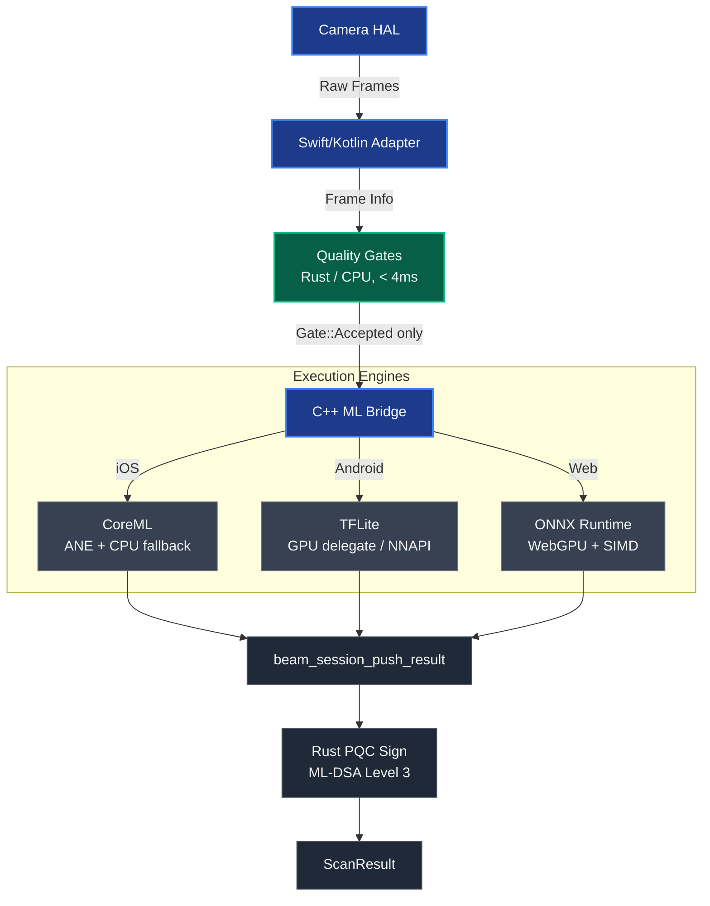

# Beam SDK

**Beam** is Surt AI's cross-platform document scanning SDK. It provides the core ML inference pipeline, quality-gated frame processing, and post-quantum signed result delivery for three Surt products: **IDV** (identity verification), **Guardian** (device integrity), and **FaceGuard** (facial authentication). Beam runs as native C++ at the ML runtime boundary and Rust for all business logic.

---

## Platform Support

| Platform | ABI | ML Backend | Status |
|----------|-----|-----------|--------|
| iOS | arm64 | CoreML (ANE + CPU fallback) | ✅ |
| Android | arm64-v8a | TFLite GPU delegate (Mali/Adreno) | ✅ |
| Android | armeabi-v7a | TFLite NNAPI + CPU fallback | ✅ |
| Web | WASM | ONNX Runtime (WebGPU + SIMD fallback) | ✅ |

---

## Quick Start

### Android (arm64-v8a)

```bash
# Install Rust Android target
rustup target add aarch64-linux-android

# Build Rust core
cd core && cargo build --release --target aarch64-linux-android

# CMake build
mkdir build_output && cd build_output
cmake -DCMAKE_TOOLCHAIN_FILE=$ANDROID_NDK/build/cmake/android.toolchain.cmake \
      -DANDROID_ABI=arm64-v8a -DANDROID_PLATFORM=android-24 \
      -DBEAM_TARGET=Android ../build
cmake --build . --config Release

# Package AAR
bash scripts/package_android_aar.sh
```

### iOS (arm64)

```bash
rustup target add aarch64-apple-ios
cd core && cargo build --release --target aarch64-apple-ios
bash ci/ios_xcodebuild.sh
bash scripts/package_ios_xcframework.sh
```

### Web (WASM)

```bash
rustup target add wasm32-unknown-unknown
bash ci/wasm_emscripten.sh
bash scripts/package_wasm_npm.sh
```

---

## Security

Beam signs every `ScanResult` with **ML-DSA Level 3** (CRYSTALS-Dilithium, NIST FIPS 204, August 2024) by default. This provides 128-bit post-quantum security against harvest-now-decrypt-later attacks.

**To disable PQC signing in development builds** (reduces latency by ~20ms on budget devices):

```kotlin
// Android
val config = SessionConfig(pqcSignResult = false)
bridge.nativeStartSession(handle, timestampUs)
```

```swift
// iOS
scanner.startScan(config: BeamScanConfig(pqcSignResult: false)) { ... }
```

```typescript
// WASM
Beam.beam_session_create({ ..., pqcSignResult: false });
```

> ⚠️ **Never disable PQC signing in production.** The default `pqcSignResult: true` is the required configuration for Surt compliance verification.

---

## Documentation

- [docs/INTEGRATION_GUIDE.md](docs/INTEGRATION_GUIDE.md) — Platform-specific integration instructions
- [docs/SECURITY_MODEL.md](docs/SECURITY_MODEL.md) — PQC threat model, key storage, attack surface
- [docs/API_REFERENCE.md](docs/API_REFERENCE.md) — Full Rust/Swift/Kotlin API reference

---

## Architecture



The C++ GPU layer is **never invoked** on a frame rejected by the quality gates.

---

## License

<!-- TODO: Add license -->
