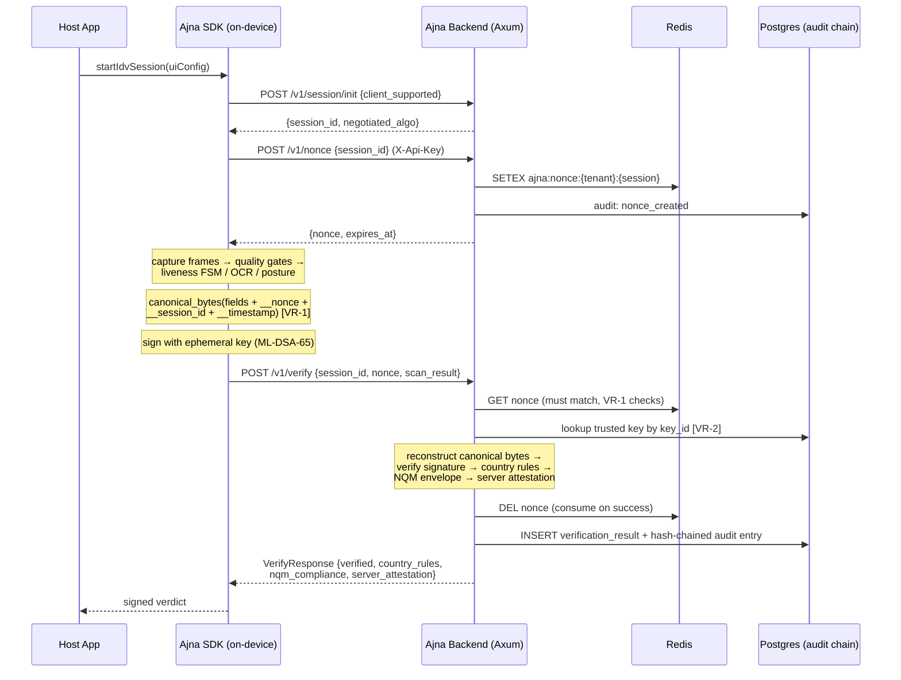

# Ajna Identity & Trust Model

> §12 criterion 6 evidence: trust model, credential lifecycle, and
> verification flows with sequence diagrams. Consolidates what README.md and
> docs/SECURITY_MODEL.md describe in prose into one navigable reference.
> Last updated: 2026-07-12 (cycle 2).

## Trust model — who trusts whom, and why

| Party | Trusts | Because |
|---|---|---|
| Relying business (tenant) | Ajna backend verdicts | Verdicts are counter-signed by the server's ML-DSA-65 attestation key and hash-chained into the tenant's SOC2 audit trail |
| Ajna backend | Pre-registered device/tenant/model keys ONLY (VR-2) | Client-supplied keys are never trusted; `key_id` selects a key registered out-of-band via the active `KEY_PROVIDER_STRATEGY` |
| Ajna backend | Nothing else from the client | Nonce freshness (VR-1), timestamp windows, tenant scoping (VR-3), rate limits |
| SDK / device | Its own capture pipeline | Quality gates + liveness FSM + posture checks run on-device; the private key never leaves the device (mlock'd, zeroed on Drop) |
| Auditor | The audit chain | Append-only Postgres trigger + SHA-256 linkage; `GET /v1/audit/verify-chain` recomputes from genesis |

Trust is **evidence-based, not channel-based**: TLS protects transport, but
every verdict stands on signatures that survive channel compromise.

## Credential lifecycle

1. **Registration (out-of-band):** tenant registers a public key in
   `trusted_public_keys` (per-tenant, per-device, or per-model — env-selected
   strategy, VR-2). This is the only trust-establishing step.
2. **Session:** SDK calls `POST /v1/session/init` → algorithm negotiation
   (ADR-001); `POST /v1/nonce` → single-use, TTL-bound, tenant-namespaced nonce.
3. **Capture & signing:** on-device pipeline produces a `ScanResult`; the
   nonce, session id, and UTC timestamp are embedded into `canonical_bytes()`
   (VR-1) and signed with the session-ephemeral key (Ed25519 or ML-DSA-65).
4. **Verification:** backend validates nonce binding, looks up the trusted
   key, reconstructs canonical bytes byte-for-byte, verifies the signature,
   evaluates country rules, and counter-signs the outcome (NQM attestation).
5. **Consumption:** nonce deleted only after signature verification (prevents
   nonce-exhaustion). Verdict + evidence written to `verification_results`
   and the hash-chained `audit_logs`.
6. **Expiry:** session keys die with the session (ephemeral by design);
   nonces expire by TTL; audit entries never expire (append-only).

There are no long-lived user credentials in the system — Ajna attests
**events** (a verification happened, with this evidence), not accounts.
Wallet-issued verifiable credentials are the Horizon-3 extension (ADR-008).

## Verification flow (happy path)



## Tamper / replay rejection flow

```mermaid
sequenceDiagram
    participant ATK as Attacker
    participant BE as Ajna Backend
    participant R as Redis

    ATK->>BE: POST /v1/verify (captured legit result, new session)
    BE->>R: GET ajna:nonce:{tenant}:{new_session}
    Note over BE: stored nonce ≠ signed_nonce embedded<br/>in canonical bytes → reject (VR-1)
    BE-->>ATK: 400 signed_nonce mismatch
    ATK->>BE: POST /v1/verify (self-signed result, own keypair)
    Note over BE: key_id resolves to registered key;<br/>attacker's key is not registered (VR-2)
    BE-->>ATK: 401 signature verification failed
    ATK->>BE: POST /v1/verify (old result, valid nonce, stale timestamp)
    Note over BE: signed_timestamp outside freshness window
    BE-->>ATK: 400 stale result
```

## Identity assurance mapping (NIST SP 800-63 vocabulary)

- Ajna IDV + Vision ≈ **identity proofing evidence collection + validation**
  (document authenticity via checksums; biometric liveness via challenge-response)
  supporting an IAL2-style remote proofing flow. Formal IAL claims await the
  SP 800-63-4 mapping task (RESEARCH.md queue) — no certification is claimed.
- Passkeys/FIDO2 handle *returning-user authentication* (AAL); Ajna proves the
  human at enrollment. Complementary, not competing (PRODUCT.md positioning).

## Criterion 6 verdict
Trust model, credential lifecycle, and sequence-diagrammed flows consolidated:
**YES (v1, cycle 2)** — formal SP 800-63-4 IAL mapping remains a research task.
