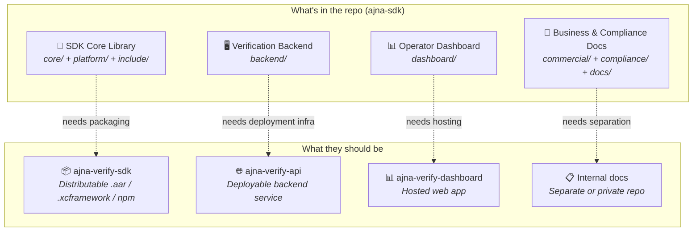
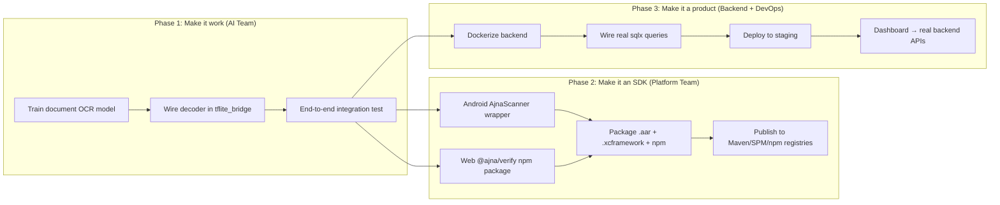

# Does Ajna SDK Justify Being Called an SDK?

> **Verdict: Not yet. It is architecturally designed to become an SDK, but today it is a monorepo containing the raw materials for four separate products, none of which are individually shippable.**

---

## 1. What IS an SDK — The Non-Negotiable Contract

An SDK (Software Development Kit) is a **distributable package** that a **third-party developer** drops into **their own application** to gain a capability they don't want to build themselves. The word "Kit" is doing the heavy lifting — it implies a self-contained, ready-to-use toolbox.

Every real-world SDK — Stripe, Firebase, Jumio, Onfido, Twilio — satisfies all five of these properties simultaneously:

| Property | Definition | Example |
|---|---|---|
| **Embeddable** | It's a library that lives inside someone else's app, not a standalone application | `pod 'Stripe'`, `implementation 'com.google.firebase:firebase-auth'` |
| **Installable in under 5 minutes** | A developer can add it to their project via a standard package manager with zero build-from-source friction | `npm install @stripe/stripe-js`, `swift package add` |
| **Has a high-level public API** | Developers interact with 3–5 well-documented classes, not internal implementation details | `Stripe.paymentSheet.present()`, not `stripe_ffi_create_payment_intent()` |
| **Self-contained** | Ships everything needed — binaries, models, configs — as a single artifact | A `.xcframework` or `.aar` that bundles the native lib + ML model |
| **Does its core job** | The primary value proposition actually works out of the box | Onfido SDK: you point it at a passport, it extracts fields. Day one. |

---

## 2. Grading Ajna SDK Against the Contract

### ✅ Property 1: Embeddable — PASS (Architecturally)

The three-layer architecture is textbook correct for a cross-platform embeddable SDK:

```
┌──────────────────────────────────────────────────┐
│  Platform Layer (Swift / Kotlin / TypeScript)     │  ← What the developer touches
├──────────────────────────────────────────────────┤
│  C++ ML Boundary (TFLite / CoreML / ONNX bridge) │  ← Invisible to the developer
├──────────────────────────────────────────────────┤
│  Rust Core (quality gates, PQC, state machine)   │  ← Invisible to the developer
└──────────────────────────────────────────────────┘
```

The Rust core compiles to a static library (`.a`). The C++ bridges link against it. The platform wrappers ([AjnaSDK.swift](file:///Users/macuser/beam-sdk/platform/ios/AjnaSDK.swift), [AjnaNativeBridge.kt](file:///Users/macuser/beam-sdk/platform/android/AjnaNativeBridge.kt)) call through FFI. This is the same architecture used by Flutter's engine, Stripe's mobile SDKs, and Mozilla's application-services layer.

**But**: There are no distributable artifacts. No `.xcframework`, no `.aar`, no npm package has ever been built. The packaging scripts exist ([package_android_aar.sh](file:///Users/macuser/beam-sdk/scripts/package_android_aar.sh), [package_ios_xcframework.sh](file:///Users/macuser/beam-sdk/scripts/package_ios_xcframework.sh), [package_wasm_npm.sh](file:///Users/macuser/beam-sdk/scripts/package_wasm_npm.sh)) but have never produced a working artifact.

### ❌ Property 2: Installable in Under 5 Minutes — FAIL

Today, integrating Ajna requires a developer to:

1. Clone the entire monorepo
2. Install the Rust toolchain
3. Install a C++ compiler
4. Build the Rust core from source (`cargo build --release`)
5. Manually link the static library into their Xcode/Gradle project
6. Copy the C++ bridge files into their build system
7. Configure CMake to find TensorFlow Lite headers

This is a **build-from-source SDK**, which is an oxymoron. No customer will do this. Compare to what it should be:

```swift
// What a developer should do (iOS):
// 1. Add to Package.swift:
.package(url: "https://github.com/ajna-ai/ajna-verify-ios.git", from: "1.0.0")

// 2. Use it:
let scanner = AjnaScanner()
try scanner.configure()
scanner.startScan { result in
    print(result.fields)
}
```

```kotlin
// What a developer should do (Android):
// 1. Add to build.gradle:
implementation 'ai.ajna:ajna-verify:1.0.0'

// 2. Use it:
val scanner = AjnaScanner(context)
scanner.startScan { result ->
    Log.d("Ajna", result.documentType)
}
```

Neither of these paths work today.

### ⚠️ Property 3: High-Level Public API — PARTIAL

**iOS**: [AjnaSDK.swift](file:///Users/macuser/beam-sdk/platform/ios/AjnaSDK.swift) has a genuine developer-facing API:

```swift
public class AjnaScanner {
    public func configure() throws        // ✅ High-level
    public func startScan(config:completion:)  // ✅ High-level
    public func stopScan()                // ✅ High-level
}
```

This is the right abstraction. A developer calls `configure()`, then `startScan()`, and gets a `AjnaScanResult` in the callback. They never see FFI handles, C structs, or Rust internals. **Grade: B+**.

**Android**: [AjnaNativeBridge.kt](file:///Users/macuser/beam-sdk/platform/android/AjnaNativeBridge.kt) exposes **raw JNI handles**:

```kotlin
class AjnaNativeBridge {
    external fun nativeCreateInferenceEngine(modelPath: String): Long  // ❌ Raw JNI
    external fun nativeOnFrame(engineHandle: Long, sessionHandle: Long, // ❌ Raw JNI
        yBuffer: ByteBuffer, uvBuffer: ByteBuffer, ...)
}
```

This is an internal implementation detail, not a public API. A customer should never see `Long` handles, `ByteBuffer` pointers, or `nativeOnFrame`. Android is missing its equivalent of `AjnaScanner` — a high-level Kotlin class that hides the JNI complexity. **Grade: D**.

**Web**: [main.ts](file:///Users/macuser/beam-sdk/samples/web/main.ts) is a sample app, not an SDK wrapper. There is no `@ajna/verify` npm package with a `AjnaScanner` TypeScript class. **Grade: F**.

### ❌ Property 4: Self-Contained — FAIL

The ML models are placeholders. The [model/](file:///Users/macuser/beam-sdk/model) directory contains a `PLACEHOLDER.tflite`. Without a real model, the SDK cannot perform its primary function. A self-contained SDK bundles everything needed to work out of the box.

### ❌ Property 5: Does Its Core Job — FAIL

The core value proposition of Ajna is: **"Point camera at a document → extract identity fields → sign them cryptographically."**

Today:
- ✅ Camera capture works (iOS and Android adapters are functional)
- ✅ Quality gates work (blur, exposure, motion, boundary detection)
- ✅ PQC signing works (ML-DSA Level 3 keygen/sign/verify)
- ❌ **Document field extraction does not work** — the inference engine runs a placeholder model, and the output decoder ([tflite_bridge.cpp](file:///Users/macuser/beam-sdk/platform/android/tflite_bridge.cpp) `decode_output_fields()`) returns hardcoded stubs
- ❌ The web sample displays **hardcoded fake data** ("JOHN SMITH", "C01X00T47")

The pipeline that transforms raw camera pixels into structured identity data — which is the entire reason a customer buys this product — does not function.

---

## 3. What the Project Actually IS Today

The `ajna-sdk` repository is not one product. It is a **monorepo containing the raw materials for four distinct products**, none of which are individually shippable:



### Product 1: The SDK (what customers embed)
**Files**: `core/`, `platform/`, `include/`, `model/`, `scripts/`, `build/`
**Status**: Architecture is sound. Core logic works. No distributable artifact exists. No working ML model.

### Product 2: The Verification Backend (what you operate)
**Files**: `backend/`
**Status**: Functional Axum server with auth, rate limiting, nonce management, SSRF protection. Has hardcoded stubs where sqlx queries should be. Not deployable to production (no Dockerfile, no k8s manifests, no Terraform).

### Product 3: The Operator Dashboard (what your customers' admins use)
**Files**: `dashboard/index.html`
**Status**: A single HTML file. Not wired to the backend. Not a product.

### Product 4: Internal Business Documents
**Files**: `commercial/`, `compliance/`, `docs/`, `publishing/`
**Status**: Useful internal documents (pricing, threat models, export control). These are not part of any shippable product.

---

## 4. Gap Analysis — What's Missing to Become a Real SDK

| Gap | Severity | Current State | Required State |
|---|---|---|---|
| **No trained ML model** | 🔴 Critical | Placeholder `.tflite` | INT8-quantized models for passport/ID card OCR |
| **No output decoder** | 🔴 Critical | `decode_output_fields()` returns hardcoded stubs | Real tensor → field parsing with vocabulary |
| **No distributable artifacts** | 🔴 Critical | Build-from-source only | Published `.aar` on Maven, `.xcframework` on SPM, npm package |
| **No Android high-level API** | 🟡 Major | Raw JNI bridge only | `AjnaScanner` Kotlin class matching iOS parity |
| **No Web SDK wrapper** | 🟡 Major | Sample app only | `@ajna/verify` npm package with TypeScript API |
| **Backend not deployable** | 🟡 Major | `cargo run` on localhost | Dockerfile + k8s + managed DB/Redis |
| **No integration test with real scan** | 🟡 Major | Simulated data only | End-to-end camera → model → verify round-trip |
| **iOS result hydration** | 🟠 Minor | `AjnaScanner` returns hardcoded fields | Wire actual Rust `ScanResult` fields back through FFI |

---

## 5. The Honest Answer

### Does it justify being called an SDK?

**No — but it justifies being called an SDK *foundation*.** What exists is the hardest part of building a cross-platform SDK:

- ✅ The Rust core with memory-safe FFI boundary — this takes months to get right
- ✅ The C-header contract with safety guarantees (VR-4 status codes, null checks)
- ✅ The PQC cryptographic pipeline — production-grade ML-DSA Level 3
- ✅ The quality gate pipeline with timing budgets
- ✅ The session state machine with adaptive relaxation
- ✅ The iOS public API design (AjnaScanner pattern)
- ✅ The backend verification server with auth, rate limiting, SSRF protection

What's missing is the **last mile** — the parts that turn raw engineering into a product a developer can install and use:

1. **The ML model** (the AI team's deliverable)
2. **The packaging** (running the existing scripts to produce .aar/.xcframework/npm)
3. **The Android API wrapper** (patterning after the iOS AjnaScanner class)
4. **The deployment infrastructure** (Dockerizing the backend)

### What should you call it right now?

Until the ML model works and distributable artifacts exist, this is more accurately described as:

> **"Ajna Verify — Cross-Platform Identity Verification Engine"**
>
> A monorepo containing the core engine, backend service, and platform bridges for building the Ajna Verify SDK. The SDK will be distributed as platform-specific packages once the ML models are trained and the packaging pipeline is validated.

### When can you honestly call it an SDK?

When a developer at a customer company can do this and have it work:

```bash
# Android
implementation 'ai.ajna:ajna-verify:1.0.0'

# iOS
.package(url: "https://github.com/ajna-ai/ajna-verify-ios", from: "1.0.0")

# Web
npm install @ajna/verify
```

And within 15 minutes, they have a working camera scanning documents, extracting real fields, and verifying signatures against your backend — without ever cloning this repo or installing Rust.

---

## 6. Recommended Path Forward



> [!IMPORTANT]
> **Phase 1 is the blocker for everything.** Without a working ML model, the SDK does not do its job, the backend has nothing real to verify, and the dashboard has nothing to display. Every other workstream is downstream of the AI team's deliverable.
